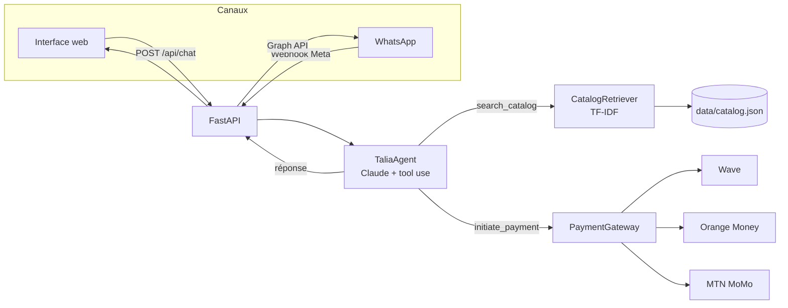

# Talia — Assistante commerciale IA

[](https://github.com/fatveli225/talia-chatbot/actions/workflows/ci.yml)


**Talia** est un agent conversationnel IA qui vend pour vous. Elle répond aux
clients sur une interface web *et* sur WhatsApp, cherche le bon produit dans
votre catalogue via RAG, répond en langage naturel, et déclenche le paiement
Mobile Money (Wave, Orange Money, MTN MoMo) une fois la commande confirmée.

La démo est configurée pour **ElectroCI**, un distributeur fictif de matériel
électrique et de solutions solaires — mais le catalogue, le nom et le
contexte métier se changent en une ligne de `.env` (`BUSINESS_NAME`,
`BUSINESS_DESCRIPTION`, `data/catalog.json`).

> Projet réalisé pour illustrer une intégration LLM de bout en bout (agent,
> tool use, RAG, webhook, interface) 

---

## Sommaire

- [Fonctionnalités](#fonctionnalités)
- [Architecture](#architecture)
- [Stack technique](#stack-technique)
- [Démarrage rapide](#démarrage-rapide)
- [Variables d'environnement](#variables-denvironnement)
- [Endpoints API](#endpoints-api)
- [Connecter WhatsApp](#connecter-whatsapp)
- [Structure du projet](#structure-du-projet)
- [Tests](#tests)
- [Limites connues & pistes d'évolution](#limites-connues--pistes-dévolution)
- [Licence](#licence)

---

## Fonctionnalités

- 💬 **Interface web de chat** — conversation en temps réel, cartes produit
  cliquables, historique par session.
- 🟢 **Bot WhatsApp** — le même agent répond sur WhatsApp via l'API Cloud de
  Meta (webhook de vérification + réception + envoi de messages).
- 🔎 **Recherche RAG sur le catalogue** — TF-IDF + similarité cosinus pour
  retrouver les produits pertinents avant de répondre ; Talia ne peut pas
  inventer un produit ou un prix qui n'existe pas dans `data/catalog.json`.
- 🛠️ **Tool use (function calling)** — Claude appelle explicitement
  `search_catalog` et `initiate_payment` plutôt que de générer des réponses
  non vérifiées : chaque affirmation sur un produit est ancrée dans une
  donnée réelle.
- 💳 **Paiement Mobile Money** — parcours complet simulé pour Wave, Orange
  Money et MTN MoMo, avec les points d'extension clairement indiqués pour
  brancher les vraies API.
- 🐳 **Prêt à déployer** — Dockerfile + docker-compose, CI GitHub Actions.

## Architecture



La logique métier (`TaliaAgent`) est indépendante du canal : le chat web et
le webhook WhatsApp appellent tous les deux `agent.reply(session_id, message)`.

## Stack technique

| Composant       | Choix                          | Pourquoi |
|-----------------|---------------------------------|----------|
| Backend         | FastAPI + Uvicorn               | Async, typé, docs OpenAPI générées automatiquement |
| LLM             | API Claude (Anthropic), tool use| Function calling fiable, bon suivi d'instructions en français |
| Recherche       | scikit-learn (TF-IDF)           | Vraie étape de retrieval, sans dépendance à une base vectorielle externe pour une démo |
| Frontend        | HTML / CSS / JS natifs          | Zéro build step, facile à auditer et à déployer |
| Messagerie      | WhatsApp Cloud API (Meta)       | API officielle, gratuite jusqu'à un certain volume |
| Paiement        | Simulation Wave / Orange Money / MTN MoMo | Parcours complet démontrable sans compte marchand |
| Déploiement     | Docker / docker-compose         | Portable, reproductible |

## Démarrage rapide

### Option A — local (Python)

```bash
git clone https://github.com/fatveli225/talia-chatbot.git
cd talia-chatbot

python -m venv venv
source venv/bin/activate        # Windows : venv\Scripts\activate

pip install -r requirements.txt

cp .env.example .env
# → ouvre .env et renseigne ANTHROPIC_API_KEY

uvicorn app.main:app --reload
```

Ouvre ensuite **http://localhost:8000** — l'interface de chat est servie
directement par le backend.

### Option B — Docker

```bash
cp .env.example .env
# → renseigne ANTHROPIC_API_KEY dans .env

docker compose up --build
```

Même URL : **http://localhost:8000**.

## Variables d'environnement

| Variable                  | Obligatoire | Description |
|----------------------------|:-----------:|--------------|
| `ANTHROPIC_API_KEY`        | ✅ | Clé API Claude ([console.anthropic.com](https://console.anthropic.com)) |
| `ANTHROPIC_MODEL`          | – | Modèle utilisé (défaut : `claude-sonnet-4-6`) |
| `WHATSAPP_VERIFY_TOKEN`    | – | Jeton choisi par toi, à recopier dans la config Meta |
| `WHATSAPP_ACCESS_TOKEN`    | – | Token d'accès généré dans Meta for Developers |
| `WHATSAPP_PHONE_NUMBER_ID` | – | ID du numéro WhatsApp Business |
| `BUSINESS_NAME`            | – | Nom injecté dans le prompt système de Talia |
| `BUSINESS_DESCRIPTION`     | – | Description injectée dans le prompt système |

Sans les variables `WHATSAPP_*`, le chat web fonctionne normalement ; seul
le canal WhatsApp reste inactif (les messages sont journalisés en console
au lieu d'être envoyés).

## Endpoints API

| Méthode | Route                    | Description |
|---------|---------------------------|--------------|
| `POST`  | `/api/chat`               | Envoie un message au chat web, retourne la réponse + les produits trouvés |
| `POST`  | `/api/payments/initiate`  | Déclenche un paiement Mobile Money (simulé) |
| `GET`   | `/webhook/whatsapp`       | Vérification du webhook (challenge Meta) |
| `POST`  | `/webhook/whatsapp`       | Réception des messages WhatsApp entrants |
| `GET`   | `/health`                 | État du service et de la configuration |

Documentation interactive générée automatiquement par FastAPI :
**http://localhost:8000/docs**

## Connecter WhatsApp

1. Crée une app sur [developers.facebook.com](https://developers.facebook.com),
   ajoute le produit **WhatsApp**.
2. Récupère le `WHATSAPP_ACCESS_TOKEN` (token temporaire ou permanent) et le
   `WHATSAPP_PHONE_NUMBER_ID` de test fourni par Meta.
3. Expose ton serveur local en HTTPS, par exemple avec ngrok :
   ```bash
   ngrok http 8000
   ```
4. Dans la configuration du webhook de l'app Meta :
   - **Callback URL** : `https://<url-ngrok>/webhook/whatsapp`
   - **Verify token** : la valeur de `WHATSAPP_VERIFY_TOKEN` dans ton `.env`
   - Abonne le champ **messages**.
5. Écris au numéro de test WhatsApp fourni par Meta — Talia répond.

## Structure du projet

```
talia-chatbot/
├── app/
│   ├── main.py           # Point d'entrée FastAPI
│   ├── config.py         # Variables d'environnement
│   ├── models.py         # Schémas Pydantic
│   ├── llm.py             # Agent Talia (Claude + tool use)
│   ├── rag.py             # Recherche catalogue (TF-IDF)
│   ├── payments.py        # Passerelle Mobile Money (simulée)
│   ├── routers/
│   │   ├── chat.py
│   │   ├── payments.py
│   │   └── whatsapp.py
│   └── static/             # Interface web (HTML/CSS/JS)
├── data/
│   └── catalog.json        # Catalogue produit de démo
├── tests/
│   └── test_rag.py
├── .github/workflows/ci.yml
├── Dockerfile
├── docker-compose.yml
└── requirements.txt
```

## Tests

```bash
pip install -r requirements-dev.txt
pytest -v
```

## Limites connues & pistes d'évolution

Ce projet est une démo destinée à montrer une architecture claire — certains
points sont volontairement simplifiés et documentés comme tels dans le code :

- **Sessions en mémoire** (`dict` Python) — à remplacer par Redis ou une base
  de données pour un déploiement multi-instance.
- **Paiements simulés** — chaque provider (`app/payments.py`) a une méthode
  `create_payment` à remplacer par un vrai appel API (liens officiels dans
  les commentaires du fichier).
- **RAG en TF-IDF** — suffisant pour un catalogue de quelques dizaines de
  produits ; pour un catalogue de plusieurs milliers de références, migrer
  vers des embeddings + une base vectorielle (Chroma, pgvector...).
- **Pas d'authentification** sur les endpoints — à ajouter avant toute
  exposition publique au-delà d'une démo.

## Licence

MIT — voir [LICENSE](LICENSE).
